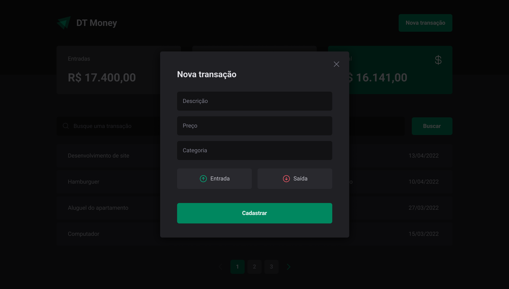
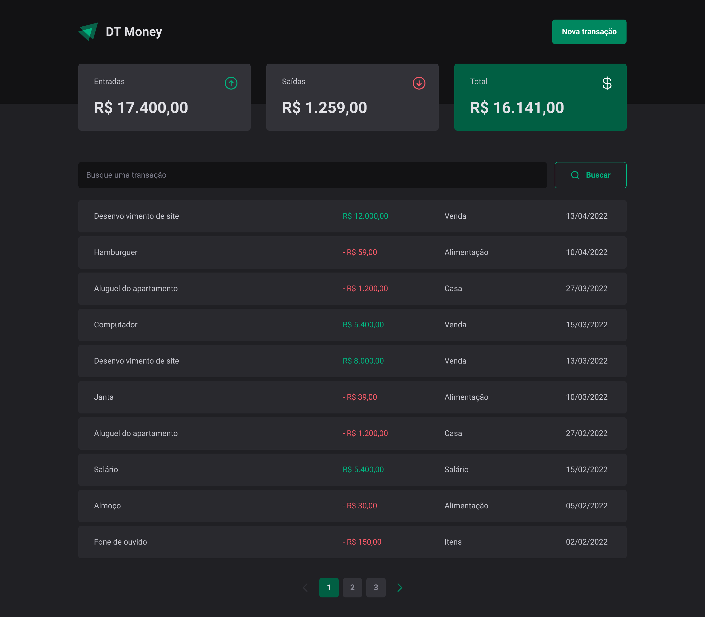

<p align="center">
  
  
  <a href="https://github.com/gabrielvbauer/dtmoney2.0/commits/master">
    
  </a>
   
  <a href="https://github.com/gabrielvbauer">
    
  </a>
 
</p>
<h1 align="center">
    
</h1>

<h4 align="center"> 
	🚧  dtmoney 2.0 💵 Concluído 🚀 🚧
</h4>

<p align="center">
 <a href="#-sobre-o-projeto">Sobre</a> •
 <a href="#-funcionalidades">Funcionalidades</a> •
 <a href="#-layout">Layout</a> • 
 <a href="#-como-executar-o-projeto">Como executar</a> • 
 <a href="#-tecnologias">Tecnologias</a> • 
 <a href="#user-content--licença">Licença</a>
</p>


## 💻 Sobre o projeto

💵 dtmoney 2.0 - é uma plataforma de gerenciamento de fluxo de caixa para auxiliar no controle de ganhos e gastos do usuário.


Projeto desenvolvido durante a trilha **ReactJS 2022 do Ignite** oferecida pela [Rocketseat](https://rocketseat.com.br).
O Ignite é um curso online com muito conteúdo prático, desafios e hacks sobre React e outras tecnologias como React Native, NodeJS e Elixir.

---

## ⚙️ Funcionalidades
- [x] Listagem de transações
- [x] Buscar de transações por título

- [x] Somatórios:
	- [x] Somatório de Receitas
	- [x] Somatório de Despesas
	- [x] Somatório total

- [x] Cadastro de novas transações informando:
	- Título
	- Valor
	- Tipo (Entrada / Saída)
	- Categoria

---

## 🎨 Layout

O layout da aplicação está disponível no Figma:

<a href="https://www.figma.com/community/file/1138814493269096792">
  
</a>

### Web

<p align="center" style="display: flex; align-items: flex-start; justify-content: center;">
  

  
</p>

---

## 🚀 Como executar o projeto

### Pré-requisitos

Antes de começar, você vai precisar ter instalado em sua máquina as seguintes ferramentas:
[Git](https://git-scm.com), [Node.js](https://nodejs.org/en/). 
Além disto é bom ter um editor para trabalhar com o código como [VSCode](https://code.visualstudio.com/)

#### 🧭 Rodando a aplicação

```bash

# Clone este repositório
$ git clone https://github.com/gabrielvbauer/dtmoney2.0.git

# Acesse a pasta do projeto no seu terminal/cmd
$ cd dtmoney2.0

# Instale as dependências
$ npm i

# Execute a aplicação em modo de desenvolvimento
$ npm run dev

# A aplicação será aberta na porta:3000 - acesse http://localhost:3000

```

#### Rodando a Fake API 

```bash

# Execute o comando para iniciar a Fake API
$ npm run dev:server

# O server será aberto na porta:3333

```

---

## 🛠 Tecnologias

As seguintes ferramentas foram usadas na construção do projeto:

#### **Website**  ([React](https://reactjs.org/)  +  [TypeScript](https://www.typescriptlang.org/) + [Vite](https://vitejs.dev/))

-   **[Axios](https://github.com/axios/axios)**
-   **[JSONServer](https://www.npmjs.com/package/json-server)**
-   **[Styled Components](https://styled-components.com/)**
-   **[Radix UI](https://www.radix-ui.com/)**

> Veja o arquivo  [package.json](https://github.com/gabrielvbauer/dtmoney2.0/blob/master/package.json)

#### **Utilitários**

-   Protótipo:  **[Figma](https://www.figma.com/)**  →  **[Protótipo (dtmoney2.0)](https://www.figma.com/community/file/1138814493269096792)**
-   Editor:  **[Visual Studio Code](https://code.visualstudio.com/)**
-   Markdown:  **[StackEdit](https://stackedit.io/)**

---

## 📝 Licença

Este projeto esta sobe a licença [MIT](./LICENSE).

---

##  Versões do README

[Português 🇧🇷](./README.md)  |  [Inglês 🇺🇸](./README-en.md)